# ⚡ EV Charging Stations Microservices Platform

A cloud-native microservices system for managing and locating **Electric Vehicle (EV) charging stations**, designed with **security, scalability, and modularity** in mind.

This project provides APIs for:
- **Authentication & Authorization** (Keycloak-backed)
- **Station Discovery** (Locator-Service)
- **Station Management & Configuration** (Configurator-Service)
- **Centralized API Gateway**
- **Shared Database & Event-driven communication**

---

## 🧭 System Overview

### Goals
- Provide secure, token-based access for users, operators, and administrators.
- Enable geolocation-based station lookup and management.
- Support multi-tenant operator configuration and station CRUD.
- Enforce consistent security and monitoring across services.

### Core Components

| Service | Description |
|----------|--------------|
| **API Gateway** | Single entrypoint for all client APIs. Handles routing, token validation, rate-limiting, and request logging. |
| **Auth-Service** | Manages users, roles, and permissions by interfacing with **Keycloak**’s Admin API. Provides token introspection and user management. |
| **Keycloak** | Identity provider for OAuth2 / OIDC token issuance, RBAC, and identity federation. |
| **Locator-Service** | Handles geospatial queries for locating nearby charging stations and returning real-time availability data. |
| **Configurator-Service** | Provides CRUD for stations, operators, and tariffs; emits update events to synchronize Locator caches. |
| **Shared Database Service** | Centralized PostgreSQL cluster with migrations and read-replicas. Shared across internal microservices. |
| **NATS (optional)** | Lightweight event bus for inter-service communication (e.g., `station.created`, `station.updated`). |

---

## 🏗️ Architecture

### Logical Zones

- **Public Zone** — Clients (mobile/web) interact with the API Gateway via HTTPS.
- **Gateway Zone** — API Gateway (Tyk / Envoy / Traefik) for routing, JWT validation, and rate-limiting.
- **Security Zone** — Auth-Service and Keycloak handle authentication, authorization, and user management.
- **Internal Zone** — Business microservices (Locator, Configurator) operate on shared PostgreSQL.
- **Infra Zone** — NATS for events, Prometheus/Grafana for metrics, Loki/ELK for logs.

### Architecture Diagram

### 🧩 Microservice API Endpoints
| Service                  | Base Path            | Example Endpoints                                       |
| ------------------------ | -------------------- | ------------------------------------------------------- |
| **Auth-Service**         | `/api/v1/auth-admin` | `POST /users`, `POST /roles`, `POST /tokens/introspect` |
| **Locator-Service**      | `/api/v1/locator`    | `GET /nearby?lat=&lng=&radius=`, `GET /{id}`            |
| **Configurator-Service** | `/api/v1/config`     | `POST /stations`, `GET /operators`, `POST /tariffs`     |
| **Shared-DB-Service**    | `/internal/db`       | `POST /migrate`, `GET /status`                          |

### ⚙️ Technology Stack
| Layer                | Technology                                       |
| -------------------- | ------------------------------------------------ |
| **Language**         | Rust (Actix-Web)                                 |
| **Authentication**   | Keycloak (OpenID Connect / OAuth2)               |
| **API Gateway**      | Tyk / Envoy / Traefik                            |
| **Database**         | PostgreSQL (with PostGIS for geospatial queries) |
| **Messaging**        | NATS (Pub/Sub)                                   |
| **Monitoring**       | Prometheus, Grafana, OpenTelemetry               |
| **Containerization** | Docker + Docker Compose / Kubernetes             |
| **Configuration**    | `.env` or `config/*.toml` per environment        |

### 📘 Documentation

- [ADR Records](assets/adr.md)
- [OpenAPI Specs](api.md)

### 🧑‍💻 Authors

S. ZOUARI — Product Owner
📧 szouari@gmail.com

M. MEZNI — Architect & Developer
📧 mamezni@gmail.com